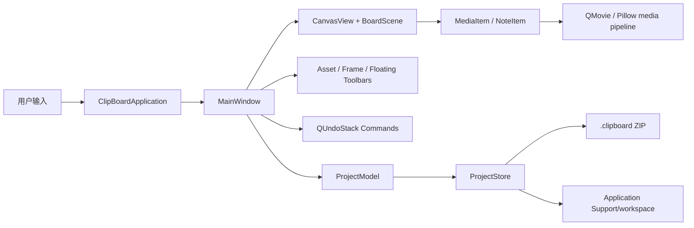
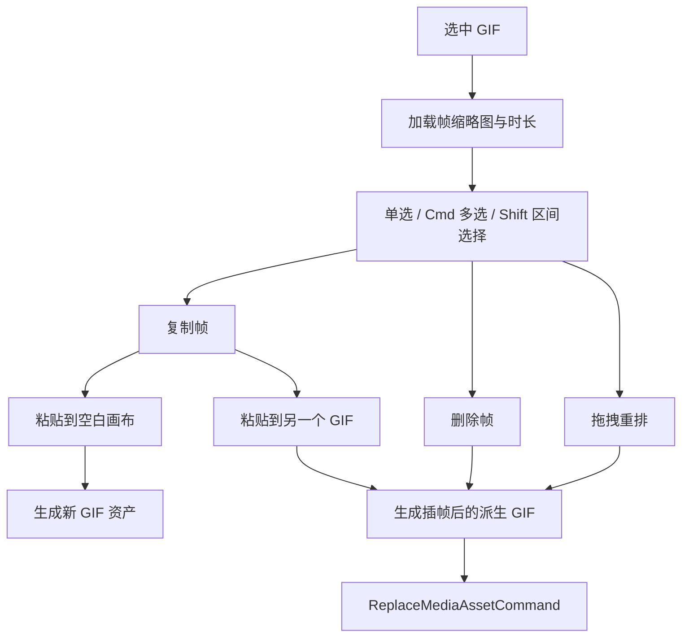
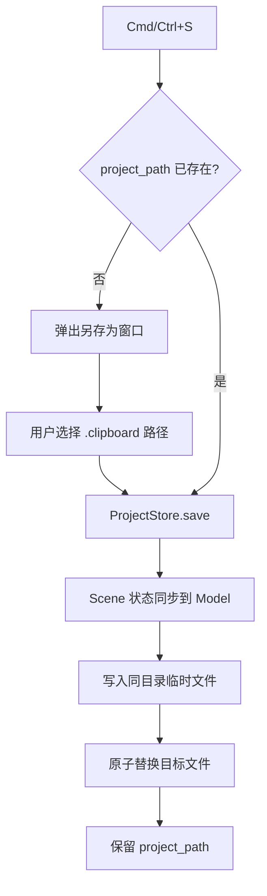

# Clip Board 软件架构与维护手册

最后维护日期：2026-06-14

本文档是 Clip Board 的架构事实来源。任何影响功能、交互、数据格式、模块职责、
快捷键、构建方式或测试范围的修改，都必须同步维护本文档，并在文末变更记录中增加一项。

## 1. 产品定位

Clip Board 是一个 macOS / Windows 桌面视觉素材板，并逐步扩展为动画示意和动画剪贴工具台。
产品中有三个明确分层：

| 概念 | 用途 | 当前状态 |
| --- | --- | --- |
| Board | 无限画布，用于收集、对比、排列和批注素材 | 已可用 |
| Asset Library | 管理导入文件、内容哈希、尺寸、帧数和工作区副本 | 已可用 |
| Composition | 固定画幅、轨道、Clip、播放头和未来关键帧 | 数据基线已建立 |

Board 不承担完整时间轴职责。Composition 不直接修改原始素材。GIF 帧编辑通过生成派生素材
实现，原素材仍保留在项目资产中。

## 2. 技术栈

| 层级 | 技术 | 说明 |
| --- | --- | --- |
| 桌面 UI | PySide6 / Qt 6 | 窗口、菜单、Dock、浮动工具栏、Graphics View |
| 画布 | QGraphicsScene / QGraphicsView | 无限空间、选择、移动、缩放、拖放 |
| 图片与 GIF | Qt QImageReader / QMovie + Pillow | 预览、逐帧读取、GIF 派生写入 |
| 数据模型 | Python dataclass | 与 Qt 解耦、可 JSON 序列化 |
| 项目存档 | ZIP + JSON | `.clipboard` 便携存档 |
| 撤销重做 | QUndoStack / QUndoCommand | 对象增删和 GIF 资产替换 |
| macOS 打包 | PyInstaller + codesign | `.app`、文件类型注册、Finder 双击打开 |

## 3. 总体运行结构



### 启动顺序

1. `clip_board.app.main()` 设置组织名、应用名和 Qt 显示策略。
2. `ClipBoardApplication` 捕获命令行参数和 macOS `QFileOpenEvent`。
3. 如果启动参数或 Finder 事件包含 `.clipboard`，把它作为初始项目。
4. `MainWindow` 创建 Scene、Canvas、Panels、Actions、Menus 和 Undo Stack。
5. 有显式存档时优先打开显式存档。
6. 没有显式存档时尝试恢复内部自动存档。
7. 没有可恢复内容时创建新的空项目。

## 4. 模块职责

| 文件 | 核心职责 | 不应承担 |
| --- | --- | --- |
| `main.py` | 最小应用入口 | 业务逻辑 |
| `clip_board/app.py` | QApplication 生命周期、启动参数、Finder 文件打开事件 | 画布业务 |
| `clip_board/main_window.py` | 工作流编排、菜单、快捷键、选择状态、保存、Undo Command | 图片解码细节 |
| `clip_board/canvas.py` | 画布缩放、平移、背景网格、框选、文件和帧拖放 | 项目序列化 |
| `clip_board/scene_items.py` | MediaItem、NoteItem、绘制、编辑、播放和格式 API | 文件对话框 |
| `clip_board/panels.py` | 素材面板、帧面板、GIF 控制条、文本编辑条 | 项目写盘 |
| `clip_board/media.py` | 素材导入、哈希去重、图片探测、GIF 逐帧读写 | UI 状态 |
| `clip_board/models.py` | 版本化、Qt 无关的数据结构 | QWidget / QColor 等 Qt 类型 |
| `clip_board/project_store.py` | 工作区、存档打包、读取、原子写入、自动存档 | 画布对象 |
| `clip_board/theme.py` | 白色主题颜色和 Qt 样式表 | 业务分支 |
| `clip_board/constants.py` | 格式、快捷配置、场景范围、Schema 版本 | 动态状态 |
| `scripts/smoke_ui.py` | 端到端 UI 回归 | 产品运行时逻辑 |

## 5. Board 与场景对象

### CanvasView

- Scene 范围为大尺寸矩形，表现为无限画布。
- 双指滚动或滚轮用于平移。
- `Cmd/Ctrl + 滚动` 和触控板捏合用于围绕指针缩放。
- 左键拖拽空白处或中键拖拽用于平移。
- `Shift + 空白拖拽` 保留为框选。
- 点击空白处清除 Scene Selection、Note 编辑态和浮动工具栏。
- 文件拖入触发 `files_dropped`，帧拖入触发 `frames_dropped`。

### MediaItem

- 静态图使用 `QImageReader` 读取。
- 动图使用 `QMovie` 播放并缓存帧。
- 支持选中、移动、缩放、旋转字段和 Z 顺序。
- 动图暴露播放、暂停、逐帧跳转和倍速接口。
- 当前播放帧通过 Signal 同步到 GIF 控制条和帧面板。

### NoteItem

- 基于 `QGraphicsTextItem`，使用 Qt 富文本 Document。
- `rich_text` 保存 HTML，因此同一标注框内可混合字号、文字颜色、粗体、斜体和下划线。
- 段落对齐按 Block Format 生效，支持左对齐、居中和右对齐。
- 背景色属于整个 Note，不属于文字选区。
- 背景色使用 ARGB 字符串保存，例如 `#60FFC430`，首字节为透明度。
- 背景色使用 Qt 非原生颜色面板，确保 Alpha 透明度控件在 macOS 上稳定显示。
- 点击空白处退出编辑、清除文字选区并取消对象选中。

## 6. 浮动工具栏

### 文本工具栏

仅在 Note 编辑态显示，顺序固定为：

1. 字体大小
2. 字体颜色
3. 批注背景颜色，支持 Alpha 透明度
4. 粗体
5. 斜体
6. 下划线
7. 左对齐
8. 居中
9. 右对齐

三个对齐按钮使用 `clip_board/assets/icons/` 下的 SVG 图标。工具栏按钮使用
`Qt.NoFocus`，避免点击格式按钮时丢失当前文字选区。

字符格式规则：

- 有文字选区时，只修改选中的文字。
- 没有文字选区时，修改后续输入使用的格式。
- 对齐作用于光标所在或选区覆盖的段落。
- 背景色作用于整个 Note，并独立于字符格式。

### GIF 控制条

- 选中 GIF 后显示。
- 包含上一帧、播放/暂停、下一帧、倍速和当前帧数。
- 点击帧数按钮展开或收起底部帧面板。
- 定位时避开可见 Note，避免覆盖批注文字。

## 7. GIF 帧工作流



- FrameStrip 维护稳定的 Shift 选择锚点。
- 点击可见帧时不主动滚动，只有当前帧越出保护范围才滚动。
- 拖拽重排生成新的帧顺序，随后写入派生 GIF。
- 删除操作至少保留一帧。
- 派生 GIF 替换画布对象的 `asset_id`，并进入 Undo Stack。

## 8. 数据模型

### ProjectModel

```text
ProjectModel
  schema_version
  name
  assets[]
  board
    items[]
    view_center_x / view_center_y / view_scale
  compositions[]
    tracks[]
      clips[]
  active_composition_id
```

### BoardItemModel

Media 和 Note 共用基础几何字段：

```text
id, kind, x, y, width, height, scale, rotation, z
```

Media 使用：

```text
asset_id, playback_rate
```

Note 使用：

```text
text
rich_text
text_color
background_color
font_size
```

`text` 是纯文本兼容值，`rich_text` 是显示和混排格式的主要来源。

### Composition / Track / Clip

Clip 保存非破坏性编辑决策：

```text
asset_id
timeline_start_ms
source_in_ms
source_out_ms
playback_rate
loop
x / y / scale_x / scale_y / rotation / opacity
```

未来关键帧应以明确类型的参数曲线加入，不使用任意字典。

## 9. 项目存档

`.clipboard` 是 ZIP 包：

```text
project.json
assets/
  <content-hash>.<extension>
```

### 保存流程



- 第一次主动保存必须经过另存为窗口。
- 后续 `Cmd/Ctrl+S` 写入第一次选定的同一地址。
- 成功写盘后才记录规范化绝对路径，保存失败不会改变当前 `project_path`。
- `Cmd/Ctrl+Shift+S` 始终允许选择新地址。
- 每 30 秒的内部自动存档用于崩溃恢复，不替代用户选择的正式存档。

### 打开流程

- 菜单 Open 使用文件对话框。
- 命令行可传入 `.clipboard` 路径。
- macOS 包注册 `com.clipboard.workbench.project` UTI。
- Finder 双击 `.clipboard` 时，LaunchServices 向应用发送文件打开事件。
- 应用未运行时创建窗口并打开文件。
- 应用已运行时把文件事件交给当前 MainWindow 加载。

## 10. 工作区与素材

内部工作区位于 Qt `AppDataLocation`：

```text
workspace/
  assets/
autosave.clipboard
```

- 素材按内容 SHA-256 去重。
- 正式存档从工作区复制所有项目引用素材。
- 读取存档时先重建工作区，再解压项目。
- 解压前校验所有 ZIP member 的目标路径，防止路径穿越。
- 正式写盘使用临时 sibling 文件和 `os.replace`，避免半写入存档。

## 11. Undo / Redo

当前 Command：

| Command | redo | undo |
| --- | --- | --- |
| `AddBoardItemCommand` | 插入对象 | 删除对象 |
| `DeleteBoardItemsCommand` | 删除对象 | 恢复模型并重建对象 |
| `ReplaceMediaAssetCommand` | 使用派生资产 | 恢复旧资产和旧帧 |

未来任何会改变用户项目内容的编辑，优先设计为 Command，而不是直接在 Widget 内修改数据。

## 12. macOS 打包与文件关联

`Clip Board.spec` 是 macOS 打包事实来源：

- 收集 `clip_board/assets/icons/*.svg`。
- 构建无 Console 的 `.app`。
- 注册 Bundle ID `com.clipboard.workbench`。
- 注册 `.clipboard` 扩展名和 UTI。
- 标记应用为该文档类型的 Editor / Owner。

`build_macos.sh`：

1. 安装本地 editable package 和 PyInstaller。
2. 使用固定 Spec 构建。
3. 复制到 `~/Applications/Clip Board.app`。
4. ad-hoc codesign。
5. 用 LaunchServices 重新注册文件类型。
6. 启动安装后的应用。

## 13. 测试策略

### 单元测试

```bash
.venv/bin/python -m unittest discover -s tests -v
```

覆盖模型往返、Schema 升级、项目打包、素材去重和 GIF 帧顺序。

### UI Smoke

```bash
QT_QPA_PLATFORM=offscreen .venv/bin/python scripts/smoke_ui.py
```

覆盖：

- 画布缩放锚点
- 空白双击不创建 Note
- Note 富文本混排、工具栏顺序、SVG 图标
- Note 背景色 Alpha 选择和持久化
- 首次保存弹出另存为，后续保存沿用路径
- macOS FileOpen 事件入口
- GIF 控制条、帧面板和工具栏避让
- Shift 选帧、复制、插帧、删除和重排
- 项目保存与重新加载

### macOS 发布前检查

```bash
./build_macos.sh
codesign --verify --deep --strict "$HOME/Applications/Clip Board.app"
plutil -p "$HOME/Applications/Clip Board.app/Contents/Info.plist"
```

还需要在 Finder 中双击真实 `.clipboard`，确认窗口标题和项目内容对应目标存档。

## 14. 扩展边界

动画工具台后续按以下边界扩展：

1. 固定画幅 Stage 与无限 Board 分离。
2. Timeline 管理时间和 Clip，不直接承担素材解码。
3. Keyframe 使用参数曲线和明确插值类型。
4. 导出、代理、缩略图和 GIF 解码进入后台 Worker。
5. FFmpeg 作为独立服务层，Widget 不拼接命令。
6. 播放使用单调时钟和媒体时间戳。
7. 所有可逆项目编辑进入 Undo Stack。

## 15. 文档维护规则

每次代码修改必须执行以下检查：

1. 模块职责有变化时，更新“模块职责”。
2. 用户流程有变化时，更新对应流程图和行为说明。
3. Model 或项目 JSON 有变化时，更新“数据模型”和 Schema 说明。
4. 保存、打开、自动恢复有变化时，更新“项目存档”。
5. 打包或文件关联有变化时，更新“macOS 打包与文件关联”。
6. 新增或删除测试时，更新“测试策略”。
7. 每次完成修改，在下方“变更记录”增加日期、内容、模块和验证方式。

此规则同时写入根目录 `AGENTS.md`，供后续开发和自动化代理读取。

## 16. 变更记录

### 2026-06-14

- 文本工具栏改为“字号、文字颜色、背景颜色、粗体、斜体、下划线、左/中/右对齐”。
- 左、中、右对齐改用独立 SVG 图标。
- Note 背景颜色增加 Alpha 透明度选择，并保存为 ARGB。
- 背景色选择使用 Qt 面板，避免 macOS 原生面板隐藏 Alpha 控件。
- 明确首次主动保存进入另存为，后续保存沿用同一 `project_path`。
- macOS 增加 `.clipboard` UTI、Finder 双击打开和运行中 FileOpen 事件处理。
- 将本文件扩展为完整架构和维护手册。
- UI Smoke 增加文本工具栏截图，并提高长按逐帧测试的计时余量。
- 验证范围：单元测试、UI Smoke、PyInstaller 构建、codesign、Info.plist 和 Finder 文件打开。
